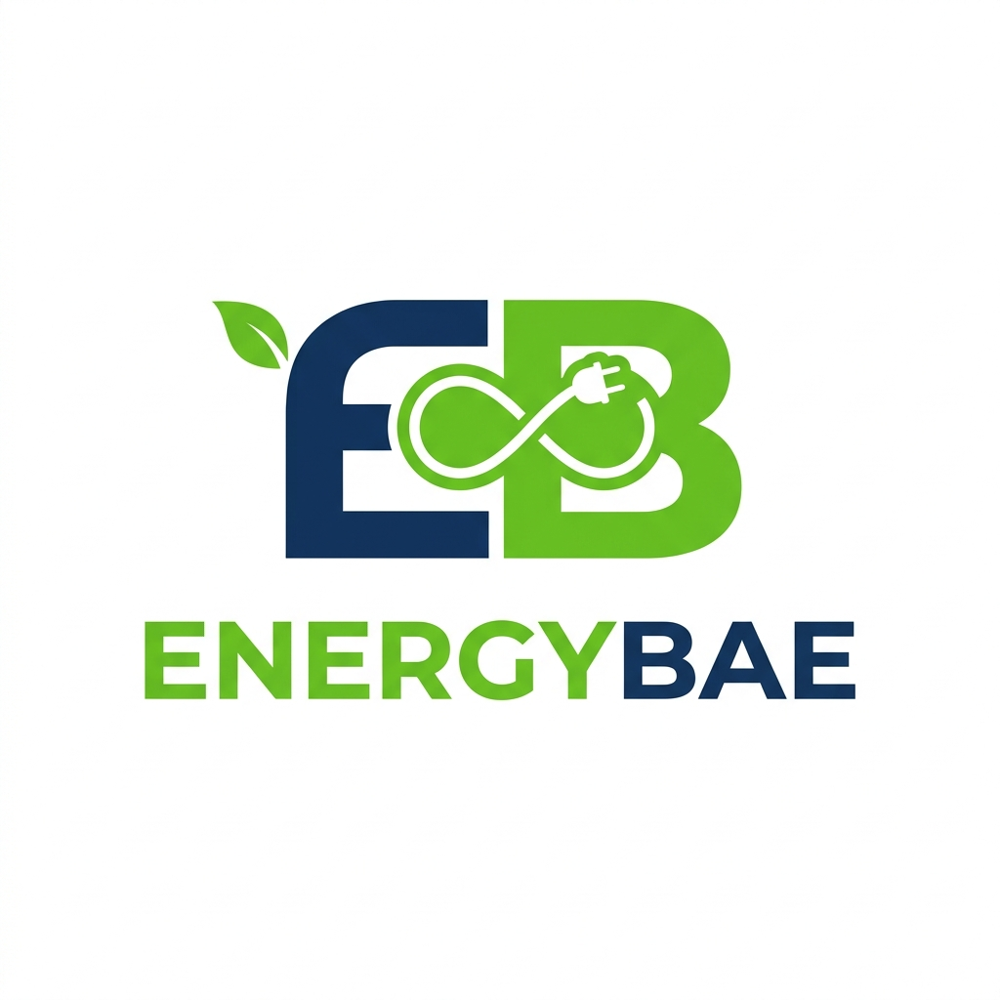

# ⚡ EnergyBae — Solar Bill Analyzer

AI-powered solar load analysis tool. Upload your MSEDCL electricity bill and get instant solar panel recommendations with a downloadable Excel report.



---

## 🏗️ Architecture

```
Solar project/
├── backend/              # Flask API server
│   ├── app.py            # Main Flask app (serves API + frontend)
│   ├── extractor.py      # Multi-AI bill data extraction
│   ├── excel_filler.py   # Solar analysis Excel generator
│   └── requirements.txt  # Python dependencies
├── frontend/             # React (Vite) frontend
│   └── src/              # React components & logic
├── nixpacks.toml         # Railway build configuration (Node + Python)
├── railway.json          # Railway deployment settings
├── Procfile              # Railway process definition
└── build.sh              # Local build script helper
```

---

## 🚀 Quick Start (Development)

### 1. Backend

```bash
cd backend
python -m venv venv
venv\Scripts\activate     # Windows
pip install -r requirements.txt

# Create .env with your API keys
cp .env.example .env
# Edit .env with your GEMINI_API_KEY, GROK_API_KEY, etc.

python app.py
# Backend runs on http://localhost:5000
```

### 2. Frontend

```bash
cd frontend
npm install
npm run dev
# Frontend runs on http://localhost:5173 (proxies /api to :5000)
```

---

## 🌍 Deployment
This project is optimized for **Single-Service Deployment on Railway**.

### 🚀 Deploying to Railway
1. **Push to GitHub**: Push this entire repository to your GitHub.
2. **Connect to Railway**:
   - Go to [Railway.app](https://railway.app) and create a new project.
   - Select "Deploy from GitHub repo".
   - Select this repository.
3. **Automatic Detection**:
   - Railway will detect the `nixpacks.toml` and `railway.json` at the root.
   - It will automatically:
     - Build the React frontend (`frontend/`).
     - Copy the build to the Flask backend (`backend/dist/`).
     - Install Python dependencies.
     - Start the Gunicorn server.
4. **Environment Variables**:
   Set the following variables in the Railway dashboard:
   - `GEMINI_API_KEY`: Your Google Gemini API key.
   - `GROK_API_KEY`: (Optional) Groq API key.
   - `OPENROUTER_API_KEY`: (Optional) OpenRouter API key.
5. **Success**: Your app will be live at a Railway-provided URL!

---

## 🔑 Environment Variables

### Backend
| Variable | Required | Description |
|---|---|---|
| `GEMINI_API_KEY` | Recommended | Google Gemini API key |
| `GROK_API_KEY` | Optional | Groq API key (gsk_...) |
| `OPENROUTER_API_KEY` | Optional | OpenRouter API key |
| `PORT` | Auto | Server port (default 5000) |

### Frontend
| Variable | Required | Description |
|---|---|---|
| `VITE_API_URL` | Production only | Backend URL (e.g. `https://api.energybae.in`) |

---

## 🛠️ Tech Stack

- **Frontend**: React 19, Vite, Framer Motion, Lucide Icons
- **Backend**: Flask, Gunicorn, OpenPyXL
- **AI**: Google Gemini, Groq Vision, OpenRouter (multi-model failover)
- **Theme**: Renewable Energy dark mode with EnergyBae brand colors

---

## 📄 License

© 2026 EnergyBae. All rights reserved.
